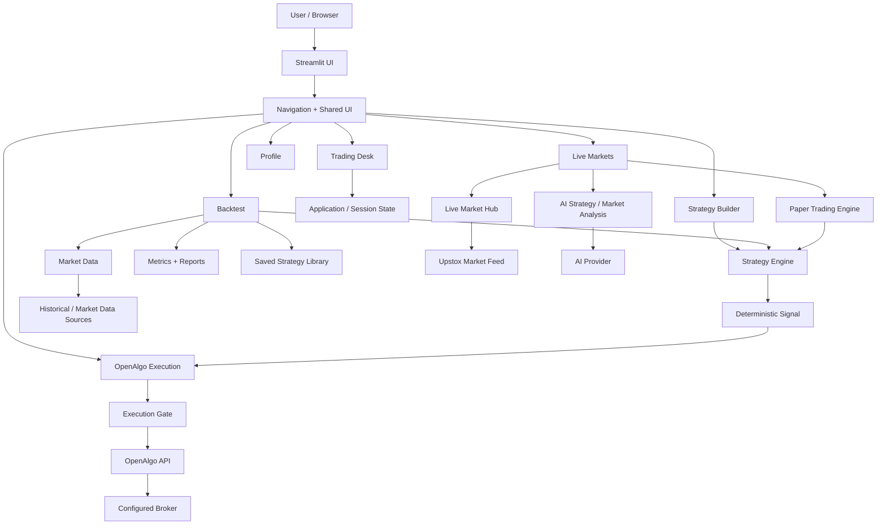
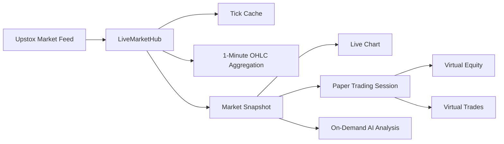
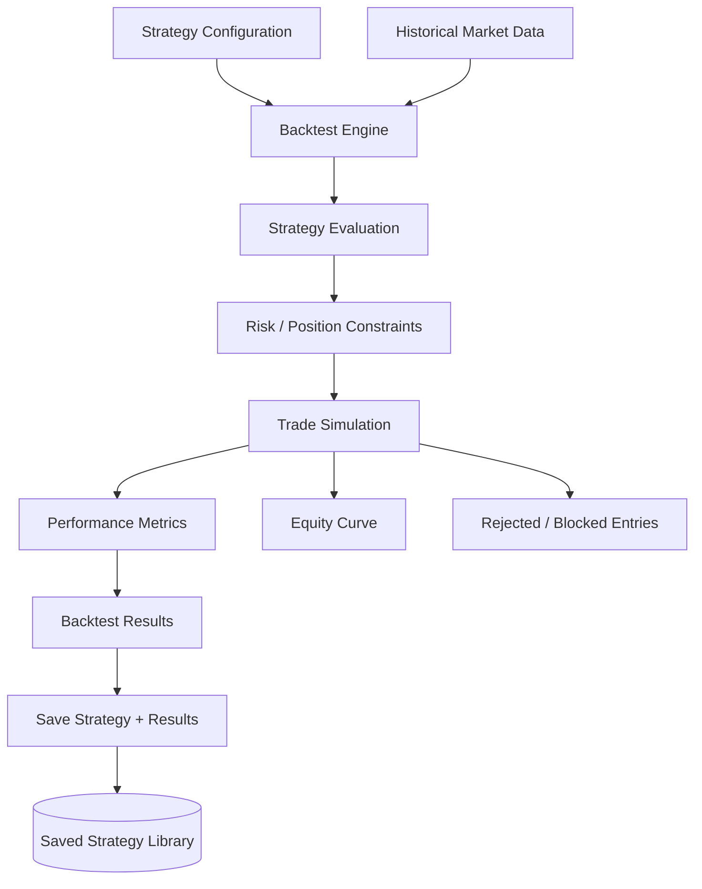
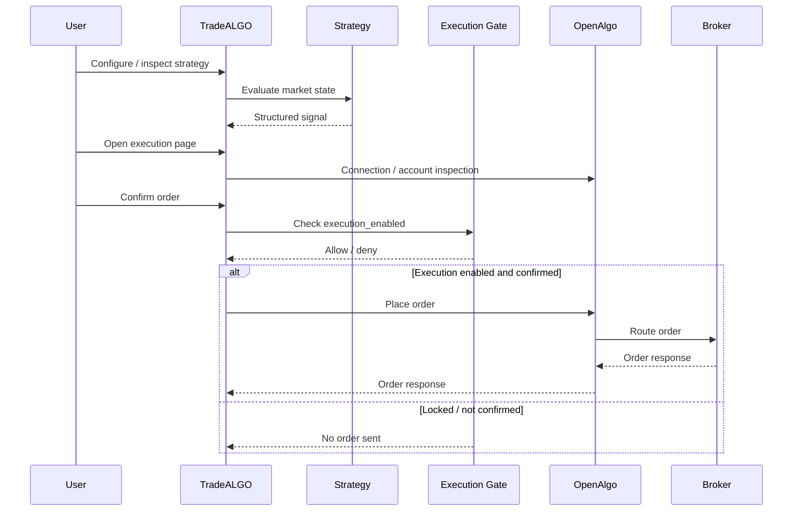

# TradeALGO Architecture

> Living architecture reference for the TradeALGO trading research and paper-trading platform.
>
> This document describes the architecture currently present in the `main` branch. It is intended to be updated whenever a major subsystem, integration boundary, or execution workflow changes.

---

## 1. System Overview

TradeALGO is a Streamlit-based trading research platform focused on:

- strategy building and experimentation
- historical backtesting
- strategy metrics and trade analysis
- saved backtest strategies
- live market observation
- deterministic paper trading
- AI-assisted research and market analysis
- risk and execution policies
- optional OpenAlgo broker execution

The system deliberately separates **research/signal generation** from **broker execution**.

The current execution boundary is:

```text
Market Data
    │
    ▼
TradeALGO Data + Research
    │
    ├── Strategy Builder
    ├── Indicators / Strategy Engine
    ├── Backtesting
    ├── Paper Trading
    └── AI Analysis
            │
            ▼
       Structured Signal
            │
            ▼
    OpenAlgo Execution Bridge
            │
       explicit gate
            │
            ▼
      OpenAlgo API
            │
            ▼
   Configured Broker Account
```

**Important:** live order routing is locked by default. The application does not enable broker execution merely because the OpenAlgo integration exists.

---

## 2. High-Level Architecture



---

## 3. Architectural Boundaries

### 3.1 Presentation Layer

The Streamlit application is the primary user-facing layer.

Responsibilities:

- render pages and navigation
- collect user configuration
- display charts, metrics, trades, and status
- expose explicit user actions
- maintain browser-session UI state
- prevent accidental execution through confirmations and gates

Primary locations:

```text
Trading_Desk.py
algobot/ui.py
pages/
```

The UI should not become the source of truth for trading calculations. Calculation and policy logic belongs in reusable `algobot/` modules.

---

### 3.2 Application / State Layer

Application state coordinates information shared between Streamlit pages and workflows.

Primary module:

```text
algobot/appstate.py
```

Examples of state include:

- current strategy configuration
- backtest configuration/results
- selected saved strategy
- live-market snapshot
- paper-trading state
- session-specific UI information

Hosted Streamlit sessions must be treated as isolated user sessions unless persistent storage is explicitly introduced.

---

### 3.3 Market Data Layer

Market data is consumed through dedicated data and live-market modules.

Relevant modules:

```text
algobot/data.py
algobot/live_data.py
algobot/live_market.py
algobot/live_chart.py
```

The live-market subsystem is responsible for receiving observed market data and converting it into application-friendly snapshots/bars.

For the live market workflow, Upstox is used as the market-feed integration.

The live feed is **observed market data**. AI is not allowed to invent prices, candles, trends, or market state.

---

## 4. Live Market Architecture

The live market subsystem is designed around a shared market stream and isolated browser-session paper accounts.



### Shared vs session-scoped state

**Shared within a server process:**

- live market connection
- incoming market ticks
- aggregated market bars
- bounded live-data caches

**Scoped to a browser session:**

- virtual capital
- virtual positions
- paper-trading trades
- session UI selections
- session-specific strategy state

This avoids creating a separate market WebSocket for every browser session while keeping paper-trading accounts isolated.

---

## 5. Strategy Architecture

Strategy logic is kept separate from UI code.

Core modules include:

```text
algobot/strategy.py
algobot/strategy_library.py
algobot/strategy_versions.py
algobot/indicators.py
algobot/config.py
algobot/engine.py
algobot/risk.py
algobot/sizing.py
algobot/execution_policy.py
```

A simplified flow is:

```text
Strategy Configuration
        │
        ▼
Indicator / Feature Calculation
        │
        ▼
Strategy Evaluation
        │
        ▼
Signal / Position Decision
        │
        ├──────────────► Backtest
        │
        ├──────────────► Paper Trading
        │
        └──────────────► OpenAlgo Execution Boundary
```

The same strategy concepts should remain reusable across historical and live/paper workflows wherever the implementation supports it.

---

## 6. Backtesting Architecture

The backtest workflow evaluates strategies against historical market data.



The backtesting system should keep the following concerns separate:

- market data
- strategy rules
- position sizing
- risk constraints
- simulated trade execution
- transaction costs
- performance metrics
- result presentation

A backtest result is research information, not a guarantee of future performance.

---

## 7. Saved Strategy Architecture

Saved strategies are handled by:

```text
algobot/saved_strategies.py
```

The library stores strategy-related information including:

- strategy name
- market
- timeframe
- configuration
- backtest result
- metrics
- creation/update timestamps
- usage count

The Strategy Builder can:

1. show the number of saved strategies
2. list saved strategies
3. select a saved strategy
4. send the selected configuration back to the Backtest workflow
5. track usage

Current storage is intentionally scoped for the application's supported session/runtime model. Persistent multi-user production storage should be introduced as a deliberate architecture change rather than assuming local SQLite is a shared hosted database.

---

## 8. AI Architecture

AI is an analysis layer, not the authoritative trading engine.

Relevant modules:

```text
algobot/ai_provider.py
algobot/ai_prompts.py
algobot/ai_strategy_agent.py
algobot/ai_advisor.py
algobot/research_context.py
algobot/explain.py
```

The intended relationship is:

```text
Observed / Computed Data
        │
        ▼
Structured Context
        │
        ▼
AI Provider
        │
        ▼
Explanation / Analysis
```

### AI safety boundary

AI should not:

- fabricate market prices
- fabricate candles or historical data
- silently replace deterministic strategy calculations
- directly bypass execution controls
- automatically retry broker orders
- turn an analysis response into an unconfirmed live order

For live-market analysis, the deterministic market/strategy state remains authoritative.

---

## 9. OpenAlgo Execution Architecture

OpenAlgo is the broker-execution boundary rather than the owner of TradeALGO's research logic.

Primary integration:

```text
algobot/openalgo_bridge.py
pages/24_OpenAlgo_Execution.py
```

### Execution flow



### Supported bridge responsibilities

The OpenAlgo bridge currently provides integration for areas such as:

- connectivity/ping
- quotes
- account state
- positions
- funds
- order book
- trade book
- order status
- place order
- smart order
- modify order
- cancel order

### Execution gate

Live execution is controlled by:

```text
TRADEALGO_EXECUTION_ENABLED=false
```

The default is `false`.

Order placement also requires explicit user interaction through the execution UI.

Orders are not automatically retried by the TradeALGO execution bridge.

---

## 10. Risk and Safety Architecture

Risk-related functionality is distributed across dedicated modules rather than being implemented only in page code.

Relevant modules include:

```text
algobot/risk.py
algobot/sizing.py
algobot/execution_policy.py
algobot/kill_switch.py
algobot/gate.py
algobot/paper_trading.py
```

Conceptually:

```text
Market State
    │
    ▼
Strategy Signal
    │
    ▼
Position / Risk Rules
    │
    ▼
Execution Policy
    │
    ├── Paper Trading
    │
    └── OpenAlgo Gate
            │
            ▼
       Broker Request
```

Safety controls should remain independent from AI-generated explanations.

---

## 11. Data and Persistence

TradeALGO currently uses multiple forms of state depending on the feature.

### Session state

Used for browser/session-specific application state.

Examples:

- current UI selections
- live paper account
- temporary strategy state
- live market snapshot

### Local / application storage

Some features use local SQLite-style storage or application-scoped storage where supported.

The saved-strategy library is implemented through:

```text
algobot/saved_strategies.py
```

### External services

The architecture can communicate with external services for:

- market data
- AI inference
- OpenAlgo execution

External credentials must be supplied through environment/secrets configuration and must never be committed to the repository.

---

## 12. Page Architecture

The Streamlit application is organized into a main entry point and page modules.

Important current areas include:

```text
Trading_Desk.py
pages/
    5_Backtest.py
    10_Strategy_Builder.py
    22_Profile.py
    23_Live_Markets.py
    24_OpenAlgo_Execution.py
```

The exact page numbering is an implementation detail. Navigation should use the shared UI/navigation layer rather than duplicating navigation logic across pages.

---

## 13. Shared UI Architecture

Shared UI behavior lives primarily in:

```text
algobot/ui.py
```

Responsibilities include:

- page setup
- navigation
- shared workflow cards
- visual styling
- common page-level UI patterns

Reusable UI components are intended to live under:

```text
ui_components/
```

New components should be adapted to Streamlit rather than introducing an unrelated frontend framework unless there is an explicit architectural decision to do so.

---

## 14. External Integration Boundaries

| Integration | Purpose | Direction | Execution capability |
|---|---|---|---|
| Upstox market feed | Live market observations | External → TradeALGO | No |
| Historical market-data sources | Backtesting/research | External → TradeALGO | No |
| AI provider | Analysis/explanation | TradeALGO ↔ AI | No direct broker authority |
| OpenAlgo | Broker execution boundary | TradeALGO ↔ OpenAlgo | Yes, when explicitly enabled |
| Configured broker | Actual order destination | OpenAlgo → Broker | Yes |

The important architectural boundary is that **market data and AI analysis do not directly place broker orders**.

---

## 15. Testing Architecture

The repository contains tests for core workflows and integrations.

Relevant areas include:

```text
tests/
```

Testing should cover:

- strategy calculations
- backtesting
- risk/position constraints
- saved-strategy round trips
- live-market parsing and aggregation
- execution gates
- OpenAlgo request behavior
- no automatic retry behavior
- UI/page behavior where practical

The CI workflows live under:

```text
.github/workflows/
```

The repository currently includes Python application/package workflows and additional health/summary automation.

---

## 16. Deployment Architecture

TradeALGO is designed as a Streamlit application.

High-level deployment flow:

```text
GitHub Repository
      │
      ▼
main branch
      │
      ▼
Streamlit Cloud
      │
      ▼
TradeALGO Streamlit Application
```

The GitHub repository is the source of truth for application code.

A deployment should be considered successful only after the hosting platform reports a successful deployment and the application is reachable.

---

## 17. Configuration and Secrets

Configuration examples are documented in:

```text
.env.example
```

Sensitive values must remain outside source control.

Examples of sensitive configuration include:

- market-data access tokens
- AI provider credentials
- OpenAlgo API keys
- broker credentials
- other authentication tokens

The repository should contain placeholders only.

---

## 18. Failure and Recovery Principles

The architecture should follow these principles:

### Market feed failure

The UI should distinguish between:

- connected
- connecting/reconnecting
- stale data
- unavailable

It should never silently display fabricated live data.

### AI failure

AI failure should not stop deterministic market or strategy calculations.

AI analysis is optional and should degrade gracefully.

### OpenAlgo failure

An OpenAlgo failure must not be interpreted as a successful broker execution.

The application should expose the returned error/status and avoid automatic order retries.

### Broker uncertainty

If order acknowledgement/status is uncertain, the system should not blindly submit the same order again.

Order state should be inspected through the supported OpenAlgo status/account APIs.

---

## 19. Concurrency Model

TradeALGO has two different concurrency scopes.

### Market-data concurrency

A shared live-market hub can maintain the upstream market stream for a server process.

```text
                  ┌── Browser A
Upstox → Hub ─────┼── Browser B
                  ├── Browser C
                  └── Browser D
```

### User/session concurrency

Each Streamlit browser session maintains its own paper-trading state.

```text
Browser A → Virtual Account A
Browser B → Virtual Account B
Browser C → Virtual Account C
```

A shared market feed must never imply a shared virtual account.

---

## 20. Recommended Dependency Direction

The intended dependency direction is:

```text
Pages / UI
   │
   ▼
Application Services
   │
   ├── Strategy
   ├── Backtest
   ├── Paper Trading
   ├── Risk
   ├── AI
   └── Integrations
           │
           ├── Market Data
           └── OpenAlgo
```

Reusable domain logic should not depend on Streamlit widgets.

For example:

**Preferred**

```text
pages/5_Backtest.py
        │
        ▼
algobot/engine.py
        │
        ▼
algobot/strategy.py
```

**Avoid**

```text
algobot/strategy.py
        │
        ▼
st.button(...)
```

This keeps core logic testable outside the Streamlit UI.

---

## 21. Security Boundaries

The most sensitive boundary is:

```text
Research / Signal Generation
            │
            ▼
       User Confirmation
            │
            ▼
       Execution Gate
            │
            ▼
        OpenAlgo API
            │
            ▼
        Broker Account
```

Security requirements:

1. Never commit credentials.
2. Keep execution disabled by default.
3. Require explicit user confirmation for order submission.
4. Never allow AI text to bypass execution policy.
5. Never automatically retry an uncertain broker order.
6. Keep broker credentials in the broker/OpenAlgo configuration boundary.
7. Log enough execution information for troubleshooting without exposing secrets.

---

## 22. Architectural Trade-offs

### Streamlit

**Benefit:** fast iteration and a unified Python application.

**Trade-off:** Streamlit's rerun/session model requires deliberate handling of state and long-running connections.

### Shared live market hub

**Benefit:** avoids one upstream market connection per browser.

**Trade-off:** requires careful thread-safety, lifecycle handling, and stale-data detection.

### AI as an analysis layer

**Benefit:** AI can explain and inspect structured market/strategy information without becoming the authoritative calculation engine.

**Trade-off:** AI latency and provider failures must be isolated from live chart rendering and deterministic strategy execution.

### OpenAlgo as execution boundary

**Benefit:** keeps broker-specific execution outside the core research/strategy engine.

**Trade-off:** there is an additional integration boundary whose connection, authentication, order status, and failure modes must be handled explicitly.

---

## 23. Current End-to-End Workflows

### Research → Backtest

```text
User
 ↓
Strategy Builder
 ↓
Strategy Configuration
 ↓
Historical Data
 ↓
Backtest Engine
 ↓
Trades + Metrics + Equity
 ↓
Save Strategy (optional)
```

### Live Market → Paper Trading

```text
Upstox
 ↓
LiveMarketHub
 ↓
Live Bars / Snapshot
 ↓
Deterministic Strategy
 ↓
Paper Trading Engine
 ↓
Virtual Position + P&L
```

### Live Market → AI Analysis

```text
Live Market Snapshot
 ↓
Structured Context
 ↓
AI Strategy Agent
 ↓
AI Analysis
```

AI analysis does not replace the deterministic market snapshot.

### Signal → OpenAlgo

```text
TradeALGO Strategy
 ↓
Signal
 ↓
OpenAlgo Execution Page
 ↓
User Confirmation
 ↓
TRADEALGO_EXECUTION_ENABLED
 ↓
OpenAlgo
 ↓
Configured Broker
```

---

## 24. Production Evolution Path

The architecture can evolve without changing the fundamental separation between research and execution.

Potential future improvements include:

1. persistent multi-user database storage
2. centralized authentication and authorization
3. stronger service health/status reporting
4. standardized network timeout/retry policies for read-only integrations
5. stronger order idempotency and reconciliation
6. persistent execution/audit records
7. dedicated background workers for long-running jobs
8. external cache/pub-sub for horizontally scaled live market feeds
9. automated accessibility and visual regression testing
10. deployment smoke tests
11. stronger observability and structured logging

These are future architecture directions, not claims that they are already implemented.

---

## 25. Architecture Rules

When adding a new feature, preserve these rules:

- **UI is not business logic.**
- **AI is not the source of truth for market data.**
- **Backtests do not guarantee future results.**
- **Paper trading must remain isolated from real broker execution.**
- **Broker execution must remain explicitly gated.**
- **External credentials never belong in source control.**
- **A broker request must not be blindly retried after an uncertain response.**
- **Shared market data must not create shared user trading state.**
- **New integrations should have a clear boundary and dedicated adapter/module.**
- **New critical behavior should have automated tests.**

---

## 26. Repository Map

A simplified map of the current repository:

```text
TradeALGO/
├── Trading_Desk.py                 # Streamlit application entry
├── pages/                          # Streamlit pages/workflows
├── algobot/                        # Core application modules
│   ├── strategy.py                 # Strategy logic
│   ├── engine.py                   # Backtest/engine functionality
│   ├── indicators.py               # Indicators
│   ├── risk.py                     # Risk rules
│   ├── sizing.py                   # Position sizing
│   ├── paper_trading.py            # Paper trading
│   ├── live_market.py              # Live market hub
│   ├── live_data.py                # Live data helpers
│   ├── live_chart.py               # Live chart helpers
│   ├── saved_strategies.py         # Saved strategy storage
│   ├── ai_provider.py              # AI provider integration
│   ├── ai_strategy_agent.py        # AI strategy analysis
│   ├── ai_prompts.py               # AI prompt definitions
│   ├── openalgo_bridge.py          # OpenAlgo integration
│   ├── execution_policy.py         # Execution policy
│   ├── kill_switch.py              # Kill-switch controls
│   ├── appstate.py                 # Application/session state
│   └── ui.py                       # Shared UI/navigation
├── tests/                          # Automated tests
├── ui_components/                  # Reusable UI component drop-zone
├── .github/workflows/              # CI / automation
├── .streamlit/                     # Streamlit configuration
├── .env.example                    # Configuration template
├── README.md                       # Project overview
├── HOSTING.md                      # Hosting notes
└── ARCHITECTURE.md                 # This document
```

---

## 27. Change Management

Architecture documentation should be updated when any of the following changes:

- a new external service is introduced
- execution behavior changes
- live market data flow changes
- persistence model changes
- authentication/authorization changes
- a major page/workflow is introduced
- concurrency model changes
- risk controls change
- a new background worker/service is introduced
- a deployment topology changes

Small UI-only changes do not necessarily require architecture updates.

---

## 28. Disclaimer

TradeALGO is a software and research platform. Backtests, paper trading results, AI analysis, and simulated performance are not guarantees of future market outcomes.

Any live trading integration should be independently tested, monitored, and operated with appropriate financial and broker-side safeguards.
